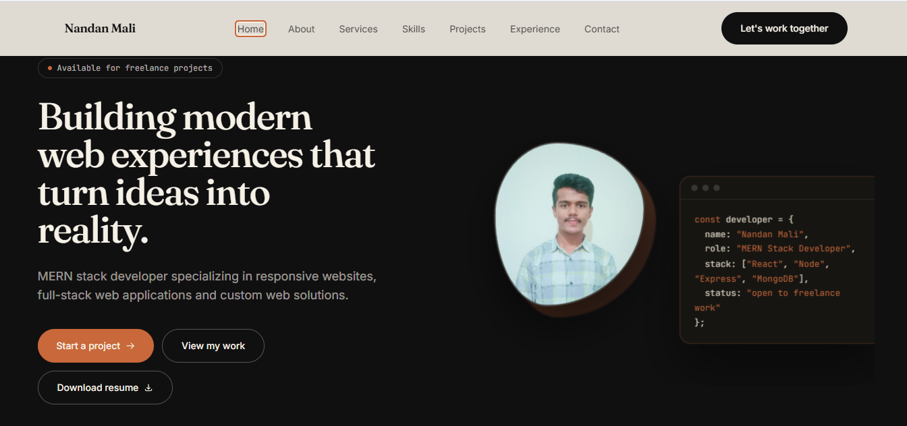

# 👋 Nandan Mali — MERN Stack Developer

### Building Modern Websites & Full-Stack Web Applications

<p align="center">
  <a href="https://nandan-mali-portfolio.vercel.app/">
    
  </a>
  <a href="https://github.com/nandanmaliofficial">
    
  </a>
</p>

<p align="center">
  
  
  
  
  
  
</p>

---

## ✦ About This Project

This repository contains my personal developer portfolio — a modern and responsive website created to showcase my **technical skills, services, projects, and professional experience**.

The portfolio is designed with a strong focus on:

- 🎨 Clean and modern visual design
- 📱 Responsive user experience
- ⚡ Smooth and interactive animations
- 🧩 Reusable React components
- 🚀 Performance and maintainability
- 💼 Professional presentation for freelance clients

> **My goal:** Build reliable digital experiences that help businesses turn ideas into working web products.

---

## 🌐 Live Portfolio

### 🚀 [Visit My Portfolio →](https://nandan-mali-portfolio.vercel.app/)

Explore my services, projects, technical skills and contact information through the live website.

---

## 🖥️ Preview

<p align="center">
  
</p>
---

# ⚡ What I Do

I help businesses, startups and individuals build, improve and modernize their web presence.

### 💻 Web Development

Modern, responsive websites designed for businesses, startups and individuals.

### ⚙️ MERN Stack Development

Full-stack web applications using:

`React.js` · `Node.js` · `Express.js` · `MongoDB`

### 🎨 Frontend Development

Responsive and reusable interfaces with a focus on usability and modern UI.

### 🔧 Backend & API Development

REST APIs, authentication, database integration and backend functionality.

### 🎯 Landing Pages

Modern landing pages designed to clearly present products, services and businesses.

### 💳 Payment Integration

Integration of payment gateways such as Razorpay and Stripe into web applications.

### 🔗 API Integration

Connecting applications with third-party APIs and external services.

### 🔄 Technology Modernization

Helping upgrade outdated websites and applications to modern technologies and development practices.

### 🛠️ Website Improvements

Bug fixing, responsiveness improvements, UI improvements and new functionality.

### 🌐 WordPress Development

Budget-friendly websites, customization and functionality improvements using WordPress.

---

# 🧰 Technology Stack

### Frontend

<p>

</p>

### Backend

<p>

</p>

### Database

<p>

</p>

### Tools & Development

<p>

</p>

### Deployment & Services

<p>

</p>

### Integrations

- 💳 Razorpay
- 💳 Stripe
- 🗺️ Google Maps / Location APIs
- 🔗 REST APIs
- 📧 Email services
- 🔐 Authentication services

---

# 🚀 Featured Project

## 📦 Movers & Packers Platform

A full-stack logistics and moving-services platform built to manage bookings, vehicles, drivers, partners and administrative operations.

### ✨ Key Features

| Feature | Description |
|---|---|
| 📋 Booking System | Customer booking and service management |
| 🚚 Vehicle Management | Vehicle and fleet management |
| 👨‍✈️ Driver Management | Driver-related operations |
| 🤝 Partner Panel | Partner and transporter functionality |
| 👨‍💼 Admin Panel | Centralized administration |
| 📍 Location Selection | Pickup and drop location functionality |
| 🔐 Role-Based System | Different user roles and functionality |
| 🔌 REST API | Backend API architecture |
| 📱 Responsive UI | Desktop and mobile-friendly interface |

### 🛠️ Built With

`React.js` · `Node.js` · `Express.js` · `MongoDB` · `Mongoose` · `Axios` · `React Router` · `React Leaflet`

---

# 🏗️ Architecture

```text
                    ┌─────────────────────┐
                    │     React.js UI     │
                    │   Responsive App    │
                    └──────────┬──────────┘
                               │
                               ▼
                    ┌─────────────────────┐
                    │      REST API       │
                    │ Node.js + Express   │
                    └──────────┬──────────┘
                               │
                               ▼
                    ┌─────────────────────┐
                    │      MongoDB        │
                    │    Database Layer   │
                    └─────────────────────┘
```

---

# 📁 Project Structure

```text
nandan-mali-portfolio/
│
├── public/
│   ├── images/
│   └── ...
│
├── src/
│   │
│   ├── components/
│   │   ├── About/
│   │   ├── Contact/
│   │   ├── Hero/
│   │   ├── Projects/
│   │   ├── Services/
│   │   └── ...
│   │
│   ├── data/
│   │   ├── projects.js
│   │   ├── services.js
│   │   └── ...
│   │
│   ├── App.jsx
│   ├── main.jsx
│   └── ...
│
├── .gitignore
├── package.json
├── package-lock.json
└── README.md
```

---

# 💻 Run Locally

## 1. Clone the repository

```bash
git clone https://github.com/nandanmaliofficial/nandan-mali-portfolio.git
```

## 2. Navigate to the project

```bash
cd nandan-mali-portfolio
```

## 3. Install dependencies

```bash
npm install
```

## 4. Start development server

```bash
npm run dev
```

The application will normally run at:

```text
http://localhost:5173
```

---

# 📦 Production Build

Create a production build:

```bash
npm run build
```

Preview the production build:

```bash
npm run preview
```

---

# ☁️ Deployment

The portfolio is deployed using **Vercel**.

### Deployment Flow

```text
GitHub
   │
   ▼
Vercel
   │
   ▼
Production Build
   │
   ▼
Live Portfolio
```

### 🌐 Live Website

**https://nandan-mali-portfolio.vercel.app/**

---

# ✨ Design & Development Principles

This portfolio follows a few key principles:

### 🎯 Client First

The website focuses on clearly communicating services and capabilities to potential clients.

### 📱 Responsive

Designed to provide a consistent experience across desktop, tablet and mobile devices.

### 🧩 Reusable Components

The React application uses reusable components to make the codebase easier to maintain.

### ⚡ Smooth Experience

Animations and interactions are used to improve the experience without overwhelming the interface.

### 🧼 Clean Code

The project structure separates UI components, data and application logic wherever practical.

---

# 🔮 Future Improvements

Some planned improvements include:

- [ ] Detailed project case studies
- [ ] More project demos
- [ ] Improved SEO
- [ ] Analytics integration
- [ ] Blog / technical articles
- [ ] Additional accessibility improvements
- [ ] More interactive project pages
- [ ] Enhanced contact functionality

---

# 🤝 Let's Work Together

Have a website, web application or business idea?

I'm available for:

**Websites • MERN Applications • Landing Pages • APIs • Integrations • Website Improvements**

### 📩 Get in Touch

<p align="center">
  <a href="https://nandan-mali-portfolio.vercel.app/">
    
  </a>
  <a href="https://github.com/nandanmaliofficial">
    
  </a>
</p>

---

# 👨‍💻 About Me

**Nandan Mali**

### MERN Stack Developer

I build modern, responsive and functional web experiences using technologies such as:

**React.js • JavaScript • Node.js • Express.js • MongoDB**

I'm interested in working with businesses, startups and individuals who need reliable web development solutions.

---

<p align="center">

### ⭐ If you find this project useful, consider giving it a star!

**Built with ❤️ using React.js**

</p>
